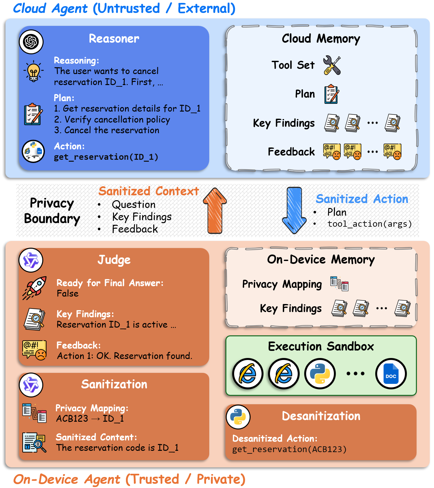

## PAAC: Privacy-Aware Agentic Device-Cloud Collaboration

[](https://www.python.org/downloads/release/python-31012/)
[](https://opensource.org/licenses/MIT)


## 🔥 Our Framework

**PAAC** (Privacy-Aware Agentic Device-Cloud Collaboration) is a decoupled framework that aligns role decomposition with the device–cloud trust boundary, following a **cloud-reason-and-plan, device-execute-and-judge** paradigm. The cloud agent reasons and plans over *sanitized* representations; the on-device agent runs **Privacy Sanitization**, **Judge**, and **Final Answer Generation**. Per-step on-device distillation keeps both agents' contexts bounded across agentic rounds, and **consensus termination** requires both sides to agree before the loop ends.

For sanitization, PAAC reframes the on-device LLM as a **proposer** of `(span, semantic-type, sanitized-text)` candidates, with an alignment check gating each commit and a deterministic, append-only **regex registry** carrying all substitution and reversal — so cloud-side actions are desanitized and dispatched to tools without a second LLM pass.

<div align="center">
    
</div>


## 🖥️ Prerequisites

Install the Python dependencies via:
```bash
pip install -r requirements.txt
```

For audio inputs, install the system `ffmpeg`/`ffprobe` binaries that `pydub` shells out to (e.g. `apt-get install ffmpeg`).

The τ²-Bench datasets (`tau2_airline`, `tau2_retail`) require the `tau2-bench-verified` package, which is not on PyPI. Clone the upstream repository and install it as an editable dependency:
```bash
git clone https://github.com/amazon-agi/tau2-bench-verified
pip install -e tau2-bench-verified
```

Set the API credentials before running:
```bash
export GEMINI_API_KEY="<your Gemini API key>"     # required for the cloud reasoner
export VLLM_PORT=8000                              # optional, defaults to 8000
```

For self-hosted on-device models (e.g. Qwen3-4B-Instruct-2507, the default in our experiments), launch a vLLM server first:
```bash
python -m vllm.entrypoints.openai.api_server \
    --model Qwen/Qwen3-4B-Instruct-2507 \
    --port 8000
```


## 📚 Benchmark Coverage

PAAC is evaluated on **20 benchmarks** spanning **12 domains**. The privacy categories of each dataset are tailored to the information most central to that task's reasoning chain (e.g. numeric values for math, entities for factual QA, transaction fields for τ²-Bench), simulating realistic privacy concerns under sanitization.

| Domain                | Dataset(s)                                                           | Privacy Categories (illustrative)            |
| --------------------- | -------------------------------------------------------------------- | -------------------------------------------- |
| Agentic               | τ²-Bench (Airline / Retail), GAIA                                    | Names, addresses, IDs, payments, files, URLs |
| Math                  | GSM8K, MathQA                                                        | Numbers                                      |
| Multimodal Math       | Geometry3K, MathVista                                                | Numbers                                      |
| Science               | SciBench, SciQ                                                       | Numbers / entities                           |
| Factual Reasoning     | TruthfulQA, HotpotQA, FEVER                                          | Entities                               |
| Logic Reasoning       | CLUTRR, AGIEval LSAT-AR                                              | Names, numbers                               |
| Medical               | MedQA                                                                | Patient profile                              |
| Finance               | FinQA                                                                | Numbers                                      |
| Accounting            | MMLU Prof. Acct., MMMU Acct.                                         | Numbers                                      |
| History               | Jeopardy MC (History)                                                | Entities                               |
| Literature            | Jeopardy MC (Literature)                                             | Entities                               |

Privacy is parameterised by `--privacy_level {0,1,2,3}`, where higher levels are **cumulative** — each level activates additional sanitized categories on top of the previous one:

- `0` — No protection (vanilla cloud-agent baseline; reasoning is performed over the original input).
- `1` — Sensitive content is confined to internal records (e.g. tool-call returns on τ²-Bench, user-uploaded files on GAIA) and never enters the transmitted query, so leakage is **trivially zero by construction**.
- `2` — Activates standard PII and task-relevant identifiers in the user query (names, emails, phones, addresses, identity docs, dates, payment info, order IDs, etc., dataset-dependent).
- `3` — Adds the broadest category set (e.g. pricing/products on τ²-Bench; URLs and search results on GAIA), exercising the strictest sanitization regime.

Non-agentic benchmarks use a single task-specific privacy axis at `P1` (e.g. *numbers* for GSM8K, *entities* for TruthfulQA, *patient profile* for MedQA). The exact per-dataset privacy categories are declared in `src/config.py`.


## 🗂️ Folder Structure
```
PAAC/
│   README.md
│   requirements.txt
│   .gitignore
│
├─── src/
│   │   main.py            # Entry point, argument parsing, run loop
│   │   config.py          # Per-dataset tool whitelist + privacy categories
│   │   data_loader.py     # 20 benchmark loaders (HF Hub + local caches)
│   │   prompts.py         # Sanitization / cloud-agent / judge / final-answer prompts
│   │   tools.py           # ToolBox + Tau2ToolBox (web, file, code, domain APIs)
│   │   utils.py           # LLM clients (Gemini / vLLM), I/O, evaluation helpers
│
├─── scripts/
│   │   run_example.sh     # Reference launcher with all flags
│
├─── figures/               # README figures
│
└─── results/               # Auto-created at runtime (per-dataset JSON traces)
```

- **`src/main.py`** — orchestrates the full pipeline: it loads the dataset, dispatches per-task threads, runs the chosen cloud `--strategy` (ReAct / Plan-and-Solve / Parallel Plan-and-Solve / RecurrentGPT) with the on-device sanitization–judge–final-answer loop, and incrementally checkpoints a JSON trace per task.
- **`src/config.py`** — declares the **per-dataset tool whitelist** and the **cumulative privacy levels** as ordered subsets of typed sensitive categories.
- **`src/prompts.py`** — every prompt: the LLM-as-proposer sanitizer, the cloud agent's planner/solver variants, the on-device Judge, the final-answer generator, the per-step reflectors (used by the `pro` tier), and the τ²-Bench server-side evaluator.
- **`src/tools.py`** — the executable tools: web search, page visit, arxiv / Wikipedia, Python sandbox, file readers (PDF / DOCX / PPTX / audio), and the τ²-Bench domain APIs. Tool execution lives in the *execution environment* and consumes desanitized arguments.
- **`src/utils.py`** — Gemini and vLLM client wrappers, JSON-repair parsing, token-aware truncation, NLTK noun/number extraction, evaluation helpers, incremental saving.


## 🏃‍♂️ Run Code

Quick start with the reference launcher:
```bash
export GEMINI_API_KEY="<your_key>"
bash scripts/run_example.sh
```

Or invoke `src/main.py` directly:
```bash
python src/main.py \
    --dataset gaia \
    --privacy_level 2 \
    --strategy parallel_plan_and_solve \
    --decision_making joint \
    --tier base \
    --local_model Qwen/Qwen3-4B-Instruct-2507 \
    --cloud_model gemini-3-flash-preview \
    --max_steps 10 \
    --num_samples 20 \
    --workers 20 \
    --run_name gaia_priv2
```

Key arguments:

| Flag                   | Choices                                                                                           | Description |
| ---------------------- | ------------------------------------------------------------------------------------------------- | ----------- |
| `--dataset`            | `tau2_airline`, `tau2_retail`, `gaia`, `gsm8k`, `math_qa`, `geometry3k`, `mathvista`, `scibench`, `sciq`, `truthful_qa`, `hotpot_qa`, `fever`, `clutrr`, `agieval_lsat_ar`, `med_qa`, `finqa`, `mmlu_professional_accounting`, `mmmu_accounting`, `jeopardy_mc_history`, `jeopardy_mc_literature` | Benchmark to evaluate on |
| `--privacy_level`      | `0`, `1`, `2`, `3`                                                                                | Cumulative sanitization scope (see above) |
| `--strategy`           | `react`, `plan_and_solve`, `parallel_plan_and_solve`, `recurrent_gpt`                             | Cloud-side reasoning paradigm; orthogonal to the on-device design |
| `--decision_making`    | `original`, `local`, `cloud`, `joint`                                                             | Termination policy. **`joint` is the paper's Consensus Termination** (`done_c ∧ done_d`); the others are unilateral ablations |
| `--tier`               | `base`, `pro`                                                                                     | `pro` wraps each on-device role with a one-step reflection pass (extensibility probe, Appendix B.10) |
| `--local_model`        | any vLLM-served HF model id (default `Qwen/Qwen3-4B-Instruct-2507`)                               | On-device LLM |
| `--cloud_model`        | any Gemini model id (default `gemini-3-flash-preview`)                                            | Cloud LLM |
| `--max_steps`          | int (default `10`)                                                                                | Maximum agentic steps per task (`T_max`) |
| `--num_samples`        | int (default `20`)                                                                                | Number of tasks per run; `-1` means all |
| `--workers`            | int (default `20`)                                                                                | Concurrent task workers |
| `--vllm_port`          | int (default `8000`)                                                                              | Port of the local vLLM server |
| `--run_name`           | str                                                                                               | Isolates the per-run scratch directory |

Per-task results are written incrementally to:
```
results/<dataset>/strategy_<strategy>_privacy_<lvl>_tier_<tier>_decision_<mode>.json
```


## 🙏 Acknowledgement

The cloud reasoner is queried through the [Google Gemini API](https://ai.google.dev/), and on-device models are served via [vLLM](https://github.com/vllm-project/vllm).
